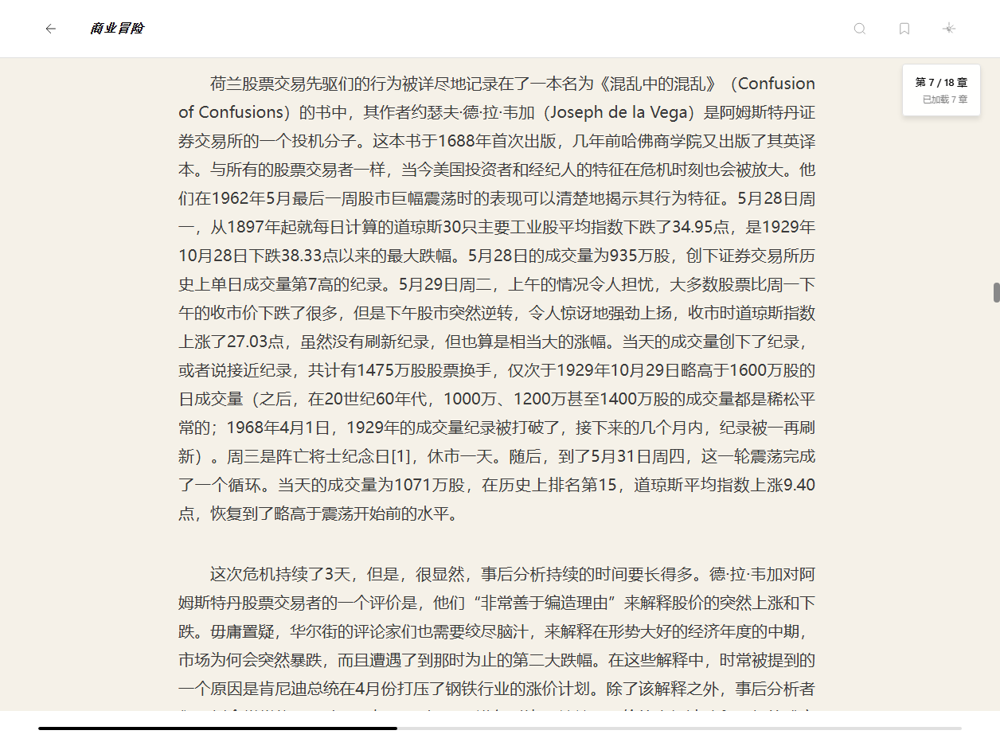

# 📚 电子书阅读器

> 一个简洁优雅的桌面电子书阅读器，基于 Electron + React 构建，提供沉浸式的阅读体验。


---

## ✨ 特性

- 📖 **多格式支持** - EPUB、PDF、TXT 等主流电子书格式
- 🎨 **丰富主题** - 3个预设主题 + 无限自定义主题
- ⚙️ **全面设置** - 字体、字号、字间距、行距、颜色完全可调
- 💾 **进度保存** - 自动保存阅读进度，随时续读
- 🔖 **书签笔记** - 添加书签和笔记，记录阅读心得
- 🔍 **全文搜索** - 快速查找书中内容
- 🎯 **沉浸式体验** - 简洁界面，专注阅读

---

## 🖥️ 界面预览

### 启动页

简洁优雅的启动界面，展示最近阅读的书籍：


**特点：**
- 欢迎界面
- 导入新书按钮
- 最近阅读书籍列表

### 阅读页

沉浸式的阅读体验，支持丰富的自定义设置：



**特点：**
- 顶部工具栏（返回、书名、搜索、书签、设置）
- 主阅读区域（支持纵向滚动）
- 右侧设置面板（可收起）
- 底部进度条

---

## 🚀 快速开始

### 环境要求

- Node.js >= 18.0.0
- npm >= 9.0.0

### 安装依赖

```bash
npm install
```

### 开发模式

```bash
# 启动 Vite 开发服务器
npm run dev

# 在浏览器中访问 http://localhost:5173/
```

### 生产构建

```bash
# 构建 Web 应用
npm run build

# 预览构建结果
npm run preview
```

---

## 📁 项目结构

```
PencilTest/
├── docs/                    # 文档目录
│   ├── 技术实现方案.md      # 完整技术方案
│   └── 开发进度.md          # 开发进度跟踪
├── electron/                # Electron 主进程
│   ├── main.ts             # 主进程代码
│   └── preload.ts          # 预加载脚本
├── src/                    # 源代码
│   ├── pages/              # 页面组件
│   │   ├── StartPage.tsx   # 启动页
│   │   └── ReaderPage.tsx  # 阅读页
│   ├── components/         # UI 组件（开发中）
│   ├── stores/             # 状态管理
│   │   ├── bookStore.ts    # 书籍状态
│   │   ├── themeStore.ts   # 主题状态
│   │   └── settingsStore.ts # 设置状态
│   ├── types/              # TypeScript 类型定义
│   ├── services/           # 业务逻辑服务（开发中）
│   ├── hooks/              # 自定义 Hooks（开发中）
│   ├── styles/             # 样式文件
│   ├── utils/              # 工具函数（开发中）
│   ├── main.tsx            # React 入口
│   └── App.tsx             # 根组件
├── public/                 # 静态资源
├── index.html              # HTML 入口
├── package.json            # 项目配置
├── tsconfig.json           # TypeScript 配置
├── vite.config.ts          # Vite 配置
└── README.md               # 本文档
```

---

## 🛠️ 技术栈

### 核心框架
- **Electron** 40.1.0 - 跨平台桌面应用框架
- **React** 19.2.4 - UI 框架
- **TypeScript** 5.7.3 - 类型安全的 JavaScript
- **Vite** 7.3.1 - 快速的构建工具

### 状态管理
- **Zustand** 5.0.10 - 轻量级状态管理

### 样式方案
- **CSS Modules** - 模块化 CSS
- **PostCSS** - CSS 处理工具

### 开发中的功能
- **epubjs** - EPUB 文件解析
- **pdfjs** - PDF 文件解析
- **IndexedDB** - 本地数据存储

---

## 📖 使用指南

### 导入电子书

1. 点击"导入新书"按钮
2. 选择电子书文件（EPUB、PDF、TXT）
3. 系统自动解析并添加到书库

### 开始阅读

1. 在启动页点击书籍卡片
2. 进入阅读界面
3. 使用鼠标滚轮或触摸板上下滚动阅读

### 调整设置

1. 点击右上角的设置图标
2. 在设置面板中调整：
   - 字体（衬线/无衬线）
   - 字号（14-32px）
   - 字间距（紧凑/标准/宽松）
   - 行距（1.5/1.8/2.0）
   - 主题（浅色/深色/暖色）
   - 背景颜色
   - 字体颜色

### 主题管理

1. 选择预设主题快速应用
2. 自定义调整后，点击"保存为新主题"
3. 输入主题名称，保存自定义主题
4. 在"我的主题"中管理自定义主题

---

## 🎨 设计理念

### 极简主义
- 去除一切不必要的元素
- 专注于内容本身
- 简洁的黑白灰配色

### 排版优先
- 使用优雅的 Playfair Display 衬线字体
- 科学的行距和字间距
- 舒适的阅读边距

### 沉浸式体验
- 全屏阅读视图
- 可隐藏的工具栏
- 流畅的滚动体验

---

## 🚧 开发路线图

### ✅ 已完成（第一阶段）
- [x] 项目初始化
- [x] 基础框架搭建
- [x] 启动页实现
- [x] 阅读页基础实现
- [x] 状态管理
- [x] 类型定义

### 🔨 进行中（第二阶段）
- [x] 完善设置面板
- [x] UI 组件库
- [x] 主题系统完善

### 📅 计划中（第三阶段）
- [x] 书籍解析服务
- [x] 数据持久化
- [ ] 书签和笔记功能

### 🎯 未来计划
- [ ] 搜索功能
- [ ] Electron 完整集成
- [ ] 打包发布

详细开发进度请查看 [docs/开发进度.md](./docs/开发进度.md)

---

## 📚 文档

- [技术实现方案](./docs/技术实现方案.md) - 完整的技术架构和实现细节
- [开发进度](./docs/开发进度.md) - 当前开发状态和后续任务

---

## 🤝 贡献

欢迎提交 Issue 和 Pull Request！

---

## 📄 许可证

ISC License

---

## 👨‍💻 作者

项目基于 Pencil 设计稿开发，使用 Electron + React 技术栈实现。

---

## 🙏 致谢

- [Electron](https://www.electronjs.org/) - 跨平台桌面应用框架
- [React](https://react.dev/) - UI 库
- [Vite](https://vitejs.dev/) - 构建工具
- [Zustand](https://github.com/pmndrs/zustand) - 状态管理
- [Pencil](https://pencil.evolus.vn/) - 设计工具

---

**开发中... 敬请期待！** 🚀
